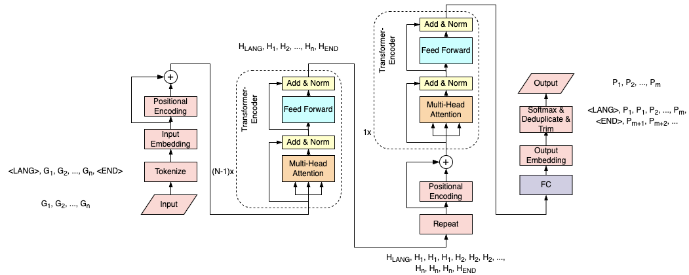

# Experiment

## 1. Transformer-LTS Baseline ([DeepPhonemizer](https://github.com/as-ideas/DeepPhonemizer))

### 1.1 Data Composition

| language | dictionary | train  | valid  | test   |
| :------- | :--------- | :----- | :----- | :----- |
| EnUs     | [CMU Dict](https://github.com/cmusphinx/cmudict) | 94,001 | 11,750 | 11,750 |

### 1.2 Baseline Model Architecture

Autoregressive Transformer, 4/6 Encoder Layers + 4 Decoder Layers,
Dimension: 512, FFN Ratio: 4, Attention Dimension: 64,
LR Scheduler: Plateau (factor 0.5, patience 1W steps, initial LR 1e-4), Optimizer: Adam

<center>


Baseline Autoregressive Transformer

</center>

### 1.3 Scripts & Configs

* Config: 
    ```bash
    ./dp/configs/1_baseline/autoreg_config_EnUs_layer6+4_dim512_ffn4_head8.yaml # Baseline_6+4
    ./dp/configs/1_baseline/autoreg_config_EnUs_layer4+4_dim512_ffn4_head8.yaml # Baseline_4+4
    ```
* Train Script:
    ```bash
    cd ./experiments/1_baseline
    sh train_autoreg_EnUs_layer6+4.sh # Baseline_6+4
    sh train_autoreg_EnUs_layer4+4.sh # Baseline_4+4
    ```

### 1.4 Results

| Model Name   | Layers | Dimension | Valid Acc. | Test Acc. | Params\*   | MACs(Average)\*  | MACs(Extreme)\* | Note      |
| :----------- | :----- | :-------- | :--------- | :-------- | :--------- | :--------------- | :-------------- | :-------- |
| Baseline_6+4 | 6+4    | 512       | 72.42%     | 72.93%    | 21.061M    | 181.103MMacs     | 454.904MMacs    | 130ksteps |
| Baseline_4+4 | 4+4    | 512       | 72.30%     | 72.64%    | 16.857M    | 143.280MMacs     | 362.449MMacs    | 124ksteps |

Notes on \*: The Calculation of Params and MACs:
* The calculation is done by using [thop](https://github.com/Lyken17/pytorch-OpCounter).
* For MACs calculation, in the average scenario, OOVs of 7 characters long are used as inputs, estimated decoder predictor steps are 7 to predict a 7 phonemes long output;
* in the extreme scenario, OOVs of 20 characters long are used as inputs, estimated decoder predictor steps are 20 to predict a 20 phonemes long output.

### 1.5 Discussions

In ["Transfomer based Grapheme-to-Phoneme Conversion"](https://arxiv.org/pdf/2004.06338), the authors use 4+4 Layers with 256 Dimension, achieving a WER of 22.1%, ~5% lower than our best model. The results are not comparable due to: 1) whether stress information is included (69 phonemes vs 39 phonemes), 2) the size of training data (94k vs 107k).

### 1.6 Future Work

* (1) Adopt Beam Search decoding strategy.
* (2) Adopt Multi-Task Learning to separate the prediction of phonemes and stresses.

## 2. Grapheme BERT ([GBERT](https://github.com/ldong1111/GraphemeBERT))

### 2.1 Data Composition

| task     | language | source                                                                                                              | train   | valid  | test   | note |
| :------- | :------- | :------------------------------------------------------------------------------------------------------------------ | :------ | :----- | :----- | :--- |
| pretrain | EnUs     | [Google Web Trillion Word Corpus](https://www.kaggle.com/datasets/rtatman/english-word-frequency?resource=download) | 300,000 | 33,333 | 0      | |
| G2P      | EnUs     | [CMU Dict](https://github.com/cmusphinx/cmudict)                                                                    | 10,000  | 11,750 | 11,750 | Valid and test data are the same as that in experiment 1; train data is random 10k from that in experiment 1.|

### 2.2 Scripts & Configs

* Config: 
    ```bash
    ./dp/configs/2_GBERT/GBERT_config_EnUs_layer6_dim512_ffn4_head8.yaml # Pretrain_layer6_dim512_ffn4_head8
    ./dp/configs/2_GBERT/GBERT_config_EnUs_layer6_dim384_ffn2_head6.yaml # Pretrain_layer6_dim384_ffn2_head6
    ```
* Train Script:
    ```bash
    cd ./experiments/2_GBERT
    sh train_GBERT_EnUs_layer6_dim512_ffn4_head8.sh # Pretrain_layer6_dim512_ffn4_head8
    sh train_GBERT_EnUs_layer6_dim384_ffn2_head6.sh # Pretrain_layer6_dim384_ffn2_head6
    ```

### 2.3 Results - Pretrain

| Model Name                                 | Mask Valid Acc. | Note       |
| :----------------------------------------- | :-------------- | :--------- |
| Pretrain_layer6_dim512_ffn4_head8          | 65.42%          | 935k steps |
| Pretrain_layer6_dim384_ffn2_head6          | 64.78%          | 845k steps, reserved for future usages |
| PretrainDistilled_layer2_dim384_ffn2_head6 | xx.xx%          | xk steps, distilled from "Pretrain_layer6_dim512_ffn4_head8", reserved for future usages |

### 2.4 Results - G2P, Train from Scratch vs Finetune from Pretrained GBERT

| Model Name                 | Layers | Dimension | Pretrained LR | Base LR | Valid Acc. | Test Acc. | Note |
| :------------------------- | :----- | :-------- | :------------ | :-----  | :--------- | :-------- | :---- |
| Scratch_10k                | 6+4    | 512       | 5e-5          | 5e-5    | 53.91%     | x%    | 184k steps |
| Finetune_10k               | 6+4    | 512       | 5e-5          | 5e-5    | **55.86%** | x%    | 176k steps, initialized from Pretrain_layer6_dim512_ffn4_head8 |
| Finetune_10k_EncoderLR0.5  | 6+4    | 512       | 2.5e-5        | 5e-5    | 55.18%     | x%    | 212k steps, initialized from Pretrain_layer6_dim512_ffn4_head8 |
<!-- | Finetune_10k_EncoderLR0.1  | 6+4    | 512       | 5e-6          | 5e-5    | x%     | x%    | | -->
<!-- | Scratch_2k                 | 6+4    | 512       |               |         | x%     | x%    | | -->
<!-- | Scratch_5k                 | 6+4    | 512       |               |         | x%     | x%    | | -->

### 2.5 Conclusions

### 2.6 Future Work

* (1) Incorporating GBERT using BERT-fusing method for offline best performance.

## 3. Move the Char Repeat Operation in Forward Transformer

### 3.1 Data Composition

Same as Experiment 1.

### 3.2 Motivation

In industrial deployment, forward transformer with faster parrellel inference is preferred. However, there is still room for model trimming, especially to deal with the long-sequence input. To repeat the input characters by three times before all encoder layers is unnecessary and would make inference for longer words in particular slow.

### 3.3 Model Architecture

<center>


Baseline Forward Transformer



Trimmed Forward Transformer

</center>

Major Changes:
* Move the char repeat operation from before all encoder layers to just before the last encoder layer.
* Add additional positional encoding after the repeat is done.

### 3.4 Scripts & Configs

* Config: 
    ```bash
    ./dp/configs/3_forward_trimmed/forward_config_EnUs_random106k_layer4_dim512_ffn4_head8.yaml # Small_Baseline
    ./dp/configs/3_forward_trimmed/forward_trimmed_config_EnUs_random106k_layer4_dim512_ffn4_head8.yaml # Small_Trimmed
    ./dp/configs/3_forward_trimmed/forward_config_EnUs_random106k_layer3_dim384_ffn2_head6.yaml # Tiny_Baseline
    ./dp/configs/3_forward_trimmed/forward_trimmed_config_EnUs_random106k_layer3_dim384_ffn2_head6.yaml # Tiny_Trimmed
    ```
* Train Script:
    ```bash
    cd ./experiments/3_forward_trimmed
    sh train_forward_EnUs_random106k_small.sh # Small_Baseline
    sh train_forward_trimmed_EnUs_random106k_small.sh # Small_Trimmed
    sh train_forward_EnUs_random106k_tiny.sh # Tiny_Baseline
    sh train_forward_trimmed_EnUs_random106k_tiny.sh # Tiny_Trimmed
    ```

### 3.5 Results

| Model          | Layers | Dimension | Char Repeat | Valid Acc. | Test Acc.  | Params\*   | MACs(Average)\*  | MACs(Extreme)\* | Note       |
| :------------- | :----- | :-------- | :---------- | :--------- | :--------- | :--------- | :--------------- | :-------------- | :--------- |
| Small_Baseline | 4      | 512       | 3           | **71.53%** | **71.63%** | 8.445M     | 194.210MMACs     | 523.522MMACs    | 180k steps |
| Small_Trimmed  | 4      | 512       | 1 -> 3      | 70.70%     | 71.10%     | 8.446M     | 106.172MMACs     | 185.766MMACs    | 206k steps |
| Tiny_Baseline  | 3      | 384       | 3           | 69.76%     | 70.13%     | **1.806M** | 41.581MMACs      | 112.088MMACs    | 188k steps |
| Tiny_Trimmed   | 3      | 384       | 1 -> 3      | 70.25%     | 70.24%     | **1.807M** | **25.141MMACs**  | **65.077MMACs** | 206k steps |

Notes on \*: The Calculation of Params and MACs:
* The calculation is done by using [thop](https://github.com/Lyken17/pytorch-OpCounter).
* For MACs calculation, in the average scenario, OOVs of 7 characters long are used as inputs;
* in the extreme scenario, OOVs of 20 characters long are used as inputs. 

### 3.6 Conclusions

* By moving the char repeat operation in the forward transformer to just before the last encoder layer, the model is optimized to be faster with comparable word accuracy rate. 
* (1) In average scenario, the small model is theoretically 45.33% faster and the tiny model is theoretically 39.54% faster;
* (2) In extreme scenario, the small model is theoretically 64.52% faster and the tiny model is theoretically 41.94% faster.
* (3) For word accuracy rate, the small model suffers 0.53% drop and the tiny model gains 0.11% after char repeat optimization, which is within error margins.
* (4) The Tiny_Trimmed model, i.e. the smallest forward transformer model, compared with the Baseline_6+4 model in Experiment, i.e. the largest autoregressive transformer model, suffers a 2.7% word accuracy rate drop from 72.93% to 70.24% while the model is theoretically 86.12% faster in avergae scenario and 85.69% faster in extreme scenario (in real deployment, the improvement in inference speed is larger due to the parrellel inference characteristic of forward transformer).

### 3.7 Future Work

* (1) Use pretrained GBERT to initialize encoder layers before the char repeat operation to see if word accuracy rate can be increased. (Combining Experiment 2 & 3)
* (2) Use distillation to improve the word accuracy rate of tiny models.

## 4. Finetuning Low-freq Words for OOVs

### 4.1 Motivation

G2P model faces huge disparity between training and inference. In training, we use dictionary words which are often times high-frequency since most dictionaries aim at collecting high-frequency words to improve text coverage rate. In testing, however, most OOVs that would be passed into G2P models to get pronunciations are irregular and low-frequency, such as named entities, loanwords, and even misspelled tokens. This experiment aimed at addressing this issue to improve the efficacy of G2P model in realistic deployment scenarios.

### 4.2 Data Composition

For the 117,501 words in [CMU Dict](https://github.com/cmusphinx/cmudict) that do not have multiple pronunciations, 25,353 words\* are not among the most frequent 1/3 million words ([Google Web Trillion Word Corpus](https://www.kaggle.com/datasets/rtatman/english-word-frequency?resource=download)) and are used for testing. The remaining words that have at least 12,711 occurences in the corpus are used for training and validation.

\* When extracting word frequencies, ' and - are removed since the word frequencies list does not consider these two as valid english alphabets.

| Stage        | Train  | Valid | Test   | Note   |
| :----------- | :----- | :---- | :----- | :----- |
| Base         | 82,934 | 9,214 | 25,353 | Training : Validation = 90% to 10%. |
| Finetune_0.2 | 16,586 | 1,842 | 25,353 | Finetune bottom 20% frequency pretrain data. |
| Finetune_0.1 | 8,293  | 921   | 25,353 | Finetune bottom 10% frequency pretrain data. |

### 4.3 Methodology

The model architecture and configuration follow the "Tiny_Trimmed" model in Experiment 3.

Four models are trained for comparison:

1\) The "Base" model is trained on the "Base";

2\) & 3\) the "Finetune_0.2" and "Finetune_0.1" models are initialized by the "Base" model and trained on the "Finetune_0.2" and "Finetune_0.1" datasets respectively;

4\) the "Scratch_0.2" model is trained directly on the "Finetune_0.2" dataset with random initialization.

### 4.4 Scripts & Configs

* Config: 
    ```bash
    ./dp/configs/4_finetune_OOV/forward_trimmed_config_EnUs_pretrain_random92k_layer3_dim384_ffn2_head6.yaml # Base
    ./dp/configs/4_finetune_OOV/forward_trimmed_config_EnUs_finetune_sortbyfreq18k_layer3_dim384_ffn2_head6.yaml # Finetune_0.2
    ./dp/configs/4_finetune_OOV/forward_trimmed_config_EnUs_finetune_sortbyfreq9k_layer3_dim384_ffn2_head6.yaml # Finetune_0.1
    ./dp/configs/4_finetune_OOV/forward_trimmed_config_EnUs_scratch_sortbyfreq18k_layer3_dim384_ffn2_head6.yaml # Scratch_0.2
    ```
* Train Script:
    ```bash
    cd ./experiments/4_finetune_OOV
    sh train_forward_trimmed_EnUs_pretrain_random92k.sh # Base
    sh train_forward_trimmed_EnUs_finetune_sortbyfreq18k.sh # Finetune_0.2
    sh train_forward_trimmed_EnUs_finetune_sortbyfreq9k.sh # Finetune_0.1
    sh train_forward_trimmed_EnUs_scratch_sortbyfreq18k.sh # Scratch_0.2
    ```

### 4.5 Results

| Model        | Valid Acc. | Valid (20%) Acc. | Valid (10%) Acc.  | Test Acc.     | Note       |
| :----------- | :--------- | :--------------  | :---------------- | :------------ | :--------- |
| Base         | **73.17%** | 66.02%           | 63.63%            | 52.45%        | 126k steps |
| Finetune_0.2 | 71.83%     | **67.81%**       | **65.36%**        | **53.97%**    | 212k steps |
| Finetune_0.1 | 72.30%     | 66.99%           | **65.36%**        | 53.20%        | 134k steps |
| Scratch_0.2  | 53.39%     | 58.90%           | 58.31%            | 46.82%        | 192k steps |

### 4.6 Conclusions

* (1) Comparing Finetune vs Pretrain
* Finetuning can lead to better word accuracy rate on both low frequency validation data and testing data. Finetuning the lowest 20% frequency words can lead to a slight improvement of word accuracy rate by 1.52% on testing data.
* Catastrophic forgetting has occured as the word accuracy rate on high frequency words has dropped after finetuning.

* (2) Comparing Finetune vs Scratch
* Pretraining on a large enough dataset is crucial.

* (3) Comparing Valid Acc. and Test Acc.
* Words that have lower frequency are harder for the model to learn its G2P relations. The data itself may be inconsistent.

### 4.7 Future Work

* (1) Employ GBERT
* Investigate the performance of GBERT finetuning on real OOVs. (Combining Experiment 2 & 4)

* (2) Change the finetuning data
* The finetuning strategy can also be used to address the disparity among datasets with different annotators. Most dictionaries are developed based on purchased / open-source dictionaries by adding new entries. These new entries are more similar to the OOVs that would be passed into G2P models and pronunciations closer to the annotation standard of newly added entries are preferred.

* (3) Better finetuning strategy
* Mix a small portion of high frequency words in finetuning low frequency words to avoid catastrophic forgetting.


## 5. Explicit Alignment

## 5.1 Hard Alignment for Training Data

### Scripts & Configs
* Data Alignment Mapping:
    ```bash
    ./datasets/alignment_scripts/EnUs_G2P_mappings.txt
    ```
* Data Alignment Script:
    ```bash
    cd ./datasets/alignment_scripts/
    python GP_align_DTW.py
    ```
* Config: 
    ```bash
    ./dp/configs/5_alignment/forward_aligned_config_EnUs_random106k_layer3_dim384_ffn2_head6.yaml
    ```
* Train Script:
    ```bash
    cd ./experiments/5_alignment
    sh train_forward_aligned_EnUs_random106k.sh
    ```

### Results

| Model          | Valid Acc. | Test Acc. | Note   |
| :------------- | :--------- | :-------  | :----- |
| Tiny_Baseline  | 69.76%     | 70.13%    | From Experiment 3 |
| Tiny_Trimmed   | 70.25%     | 70.24%    | From Experiment 3 |
| Tiny_Aligned   | 69.63%     | 70.14%    | |


## 6. Combination of Different Strategies: GBERT, Trimmed Forward Transformer, Finetuning OOV

### 6.1 Data Composition

| Stage            | Train   | Valid  | Test   | Note   |
| :--------------- | :------ | :----- | :----- | :----- |
| GBERT            | 300,000 | 33,333 | 25,353 | From Experiment 2 |
| G2P_Base         | 82,934  | 9,214  | 25,353 | From Experiment 4 |
| G2P_Finetune_0.2 | 16,586  | 1,842  | 25,353 | From Experiment 4 |

### 6.2 Methodology

The model architecture and configuration follow the "Tiny_Trimmed" model in Experiment 3 & 4.

Four models are trained for comparison:

1\) The "Tiny_Trimmed_Base" model is trained with random initialization on the "G2P_Base" data (the same as the "Base" Model in Experiment 4);

2\) the "Tiny_Trimmed_Finetune" model is trained with initializing from the "Tiny_Trimmed_Base" model on the "G2P_finetune_0.2" data (the same as the "Finetune_0.2" Model in Experiment 4);

3\) the "GBERT_Tiny_Trimmed_Base" model is trained with **initializing from the first and last layer of GBERT model** ("Pretrain_layer6_dim384_ffn2_head6" model in Experiment 2) on the "G2P_Base" data;

4\) the "GBERT_Tiny_Trimmed_Finetune" model is trained with initializing from the "GBERT_Tiny_Trimmed_Base" model on the "G2P_finetune_0.2" data.

### 6.3 Scripts & Configs


### 6.4 Results

| Model                        | Encoders | Valid Acc. | Valid (20%) Acc. | Test Acc.     | Note       |
| :--------------------------- | :------- | :--------- | :--------------  | :------------ | :--------- |
| Tiny_Trimmed_Base            | 2+1      | **73.17%** | 66.02%           | 63.63%        | 126k steps |
| Tiny_Trimmed_Finetune        | 2+1      | 71.83%     | **67.81%**       | **65.36%**    | 212k steps |
| GBERT_Tiny_Trimmed_Base      | 2+1      | 72.56%     | 65.20%           | 51.79%        | 112k steps |
| GBERT_Tiny_Trimmed_Finetune  | 2+1      | 69.26%     | 66.50%           | 52.66%        | 218k steps |

Problem: Adding GBERT makes accuracy drop on both validation and testing.

1\) Initializing from the first and last layer of GBERT model is problematic.

2\) GBERT data is too little for generalization over the test set which does not include any word in the pretraining data.


Ablation Experiments

Use large enough encoder and initialize from the entire GBERT

| Model                        | Encoders | Valid Acc. | Valid (20%) Acc. | Test Acc.     | Note       |
| Large_Trimmed_Base           | 6+1      | | | | |
| Large_Trimmed_Finetune       | 6+1      | | | | |
| GBERT_Large_Trimmed_Base     | 6+1      | | | | 218k |
| GBERT_Large_Trimmed_Finetune | 6+1      | | | | |

